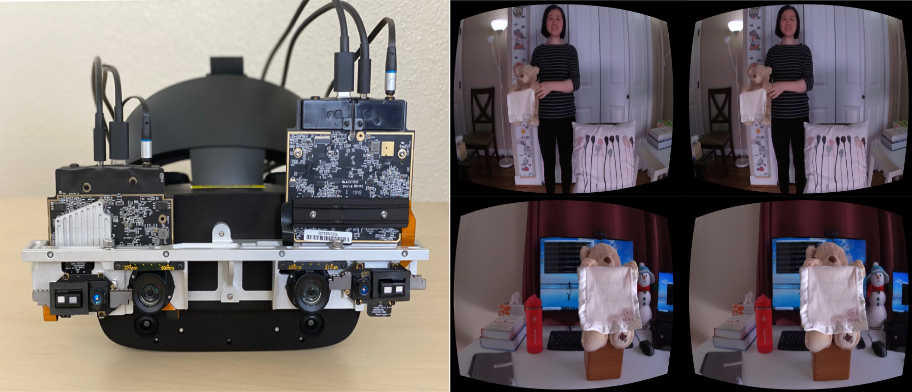

# NeuralPassthrough

## Introduction

This repository provides source code, trained neural network model and dataset for our [NeuralPassthrough](https://research.facebook.com/publications/neural-passthrough/) work that is published at SIGGRAPH 2022. Note that the provided code is its Python implementation version, prior to customized real-time inference optimization in C++. 

If you use this code, model or dataset, please cite the publication: \
`Lei Xiao, Salah Nouri, Joel Hegland, Alberto Garcia Garcia, and Douglas Lanman. "NeuralPassthrough Learned Real-Time View Synthesis for VR". ACM SIGGRAPH 2022.`

## Installation

The code has been tested with Anaconda 3 on Windows 10.

1. Download third-party code. \
Please download [RAFT-Stereo](https://github.com/princeton-vl/RAFT-Stereo), and place the unzipped files under `/code/third_party/RAFT_Stereo/`. For example, the `/core` subfolder in the original RAFT-Stereo repo should be `/code/third_party/RAFT_Stereo/core/`. Please follow the instructions in the original RAFT-Stereo repo to set the code up, although you don't need to download any training or test dataset. \
\
A few changes about the relative paths in the RAFT-Stereo code are required for NeuralPassthrough to call their functions correctly. Specifically, in the file `/code/third_party/RAFT_Stereo/core/raft_stereo.py` and `/code/third_party/RAFT_Stereo/core/corr.py`, please remove `core` from all the lines like `from core.xxx import xxx`. For example, change `from core.utils.utils import bilinear_sampler` to  `from .utils.utils import bilinear_sampler`. \
\
Please download their pretrained models and place them under `/third_party/RAFT_Stereo/models/`. For example, the model used in our NeuralPassthrough implementation should be `/third_party/RAFT_Stereo/models/raftstereo-realtime.pth`. \
\
Our method also use the softmax splatting code that can be found [here](https://github.com/sniklaus/softmax-splatting). The code was minorly edited and included in our repo (i.e. `/code/softsplat.py`) for convenience. You don't need to download it from its original repo.

2. Download dataset.\
The dataset is stored as a Git LFS file at `/data/test.zip`. Please make sure it's downloaded correctly (1.85GB). Unzip it and place its subfolders under `/data/test/`. For example, the `/real` subfolder should be `/data/test/real/`.

3. Create Conda environment.\
In your Conda terminal, run the following commands to set up the Conda environment.\
`conda env create -f environment.yaml`\
`conda activate neuralpassthrough`

4. Run.\
You should be able to run the code now. In your Conda terminal, go to folder `/code`. The entry files for testing with real captured examples and rendered synthetic exapmles are `test_prototype.py` and `test_synthetic.py` respectively. For example, you can run `python test_prototype.py`.\
\
You can change the specific test scenes in these files (e.g. look for "select scene" in the code). The output images will be saved to a new folder automatically created under the root directory.

## License
NeuralPassthrough is MIT licensed, as found in the LICENSE file.
